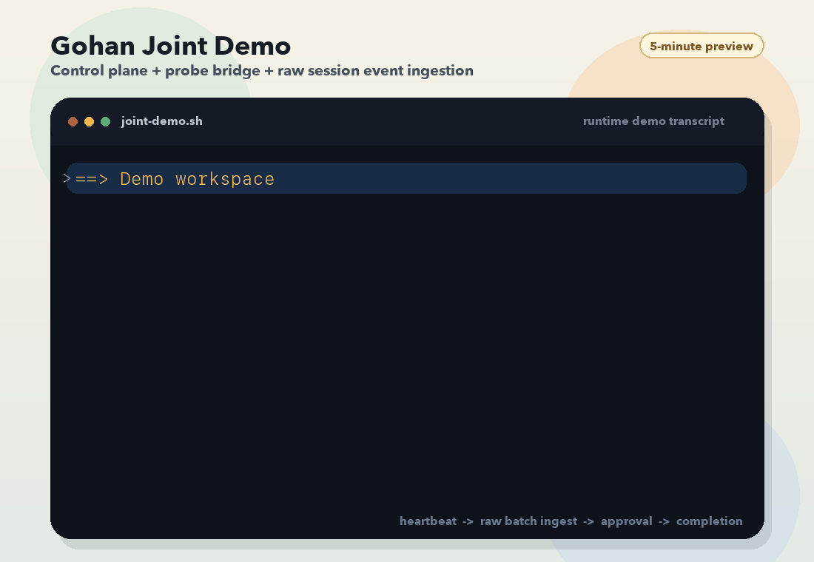

# Gohan

[English](README.md) | [中文](README.zh-CN.md)

Open source runtime control plane for long-running agents and browser workers.

Gohan is for the part that usually breaks after an agent already "works":

- which task is running where
- which runtime event belongs to which task run
- whether the agent is still alive, blocked, or actually done
- how to pause for approval or human input without losing execution identity
- how to keep browser workloads out of long-lived chat/session state

Gohan sits between agent builders, execution environments, and platform APIs. It manages runtime lifecycle instead of prompt orchestration.

## Run The 5-Minute Demo

```bash
npm install
python3 -m pip install -r services/probe-bridge/requirements.txt
npm run demo:joint
```



The joint demo starts a control plane plus a probe bridge, then walks one task through:

1. probe heartbeat
2. task creation
3. task run start
4. raw runtime event batch ingestion from the probe
5. approval creation
6. approval resolution
7. task completion

See [docs/LOCAL_DEMO.md](docs/LOCAL_DEMO.md) for the scripted flow, GIF generation, fallback single-process demo, and checked-in terminal transcript.
The latest plain-text transcript lives at [docs/assets/gohan-control-plane-probe-bridge-demo.txt](docs/assets/gohan-control-plane-probe-bridge-demo.txt).

## Why Gohan Exists

Agent tooling is strong at a few layers already:

- SDKs and frameworks help build agents
- tracing tools help observe them
- browser/tool runtimes help execute them

What is still weak in many teams is the runtime control-plane layer:

- task/run state
- session and runtime identity
- human approval and input gates
- browser work isolation
- remote runtime bridging
- heartbeat and online-state derivation

That is the gap Gohan is trying to fill.

## Where Gohan Fits

Gohan is not trying to replace everything around it.

- Agent SDKs build agents and tool graphs.
- Temporal or Prefect orchestrate durable business workflows.
- Kubernetes schedules compute and infrastructure workloads.
- Gohan manages the runtime lifecycle of agent workloads: `Task`, `TaskRun`, `Approval`, runtime events, probe heartbeats, and browser-task boundaries.

In other words: Gohan is not "another agent framework." It is the runtime control layer around already-existing agents.

## Use Gohan When

- you already have agents, but runtime state is still hand-rolled
- approvals or human input need to be first-class runtime states
- browser work should run in an isolated execution path
- remote runtimes need to report back into one control plane
- session ids, run ids, and workflow state are spreading across too many ad-hoc scripts

## Gohan Is Not

- another agent SDK
- another chat UI
- another tracing-only product
- a general-purpose workflow engine
- a Kubernetes replacement

## Core Primitives

The open source cut is centered on a small set of primitives:

- `AgentRuntime`: a managed execution target
- `Task`: the user-facing unit of work
- `TaskRun`: the concrete execution attempt for a task
- `Approval`: a human approval or input gate
- `RuntimeEvent`: normalized execution events from probes or workers
- `BrowserTask`: a browser-bound workload routed to a dedicated worker
- `BrowserTaskExecutionResult`: structured browser output returned to the control plane

These names may still tighten further as the public model stabilizes.

## What Works Today

The repository is still early, but it is no longer just a naming exercise. The current extraction already includes:

- an in-memory control-plane app with task, task-run, approval, and runtime-event routes
- a public runtime protocol for runtime agents, probe heartbeats, and raw event batch ingestion
- a joint control-plane + probe-bridge demo that exercises heartbeat -> raw batch ingest -> approval -> completion
- a probe-bridge baseline in Python that prefers the public Gohan protocol
- a browser-worker mock loop with shared execution/result contracts
- local tests plus GitHub Actions CI

## Current Limitations

This is still an early-stage public extraction. That means a few things are true at the same time:

- the direction is intentional
- the abstractions are real
- the implementation is still incomplete

Current limits to be aware of:

- the control-plane app is still demo-grade and uses an in-memory store
- some public interfaces will still change before a real `v0.1`
- deployment and persistence stories are intentionally thin right now
- the current probe-bridge baseline is still OpenClaw-oriented, while the public runtime protocol is being shaped to support broader adapters over time

## Architecture

```text
                 +---------------------------+
                 |      Gohan Control Plane  |
                 |---------------------------|
                 | task API / task runs      |
                 | approvals / runtime state |
                 | event correlation         |
                 +-------------+-------------+
                               |
               +---------------+----------------+
               |                                |
     +---------v---------+            +---------v---------+
     |   Probe Bridge    |            | Browser Worker    |
     |-------------------|            |-------------------|
     | session tracking  |            | isolated runs     |
     | event forwarding  |            | structured output |
     | heartbeat / send  |            | browser-specific  |
     +---------+---------+            +---------+---------+
               |                                |
               v                                v
        remote agent runtime              browser runtime
```

## Repository Layout

```text
gohan/
  apps/
    control-plane/     # in-memory HTTP server exposing task, approval, and runtime-event routes
  services/
    probe-bridge/      # Python bridge forwarding remote runtime events and heartbeats to Gohan
    browser-worker/    # mock browser-task execution loop and result reporting boundary
  packages/
    contracts/         # shared runtime, control-plane, probe, and browser-worker types
    core/              # runtime decision logic and task workflow helpers
  docs/                # demo, protocol, architecture, and release-prep documentation
```

## Development

Current first commands:

```bash
npm install
npm run typecheck
npm test
npm run demo
npm run check:release
```

## Docs

- [docs/LOCAL_DEMO.md](docs/LOCAL_DEMO.md): manual demo flow
- [docs/RUNTIME_PROTOCOL.md](docs/RUNTIME_PROTOCOL.md): public execution/control-plane handshake
- [docs/ARCHITECTURE.md](docs/ARCHITECTURE.md): architecture notes
- [docs/EXTRACTION_PLAN.md](docs/EXTRACTION_PLAN.md): what belongs in the first open source cut
- [CONTRIBUTING.md](CONTRIBUTING.md): contribution workflow
- [docs/FIRST_RELEASE_CHECKLIST.md](docs/FIRST_RELEASE_CHECKLIST.md): release-prep checklist
- [docs/LICENSE_OPTIONS.md](docs/LICENSE_OPTIONS.md): license tradeoffs
